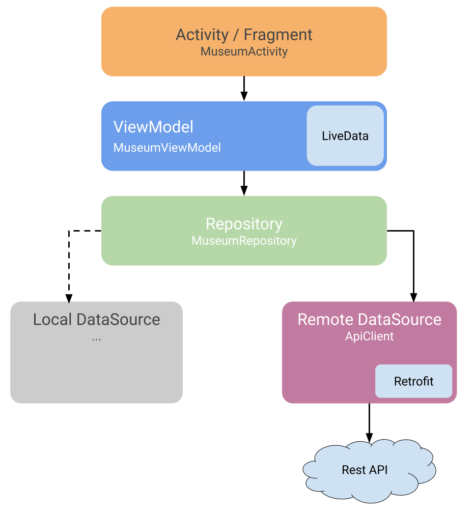

## Jetpack MVVM + Kotlin + Coroutine

这是一个使用 Kotlin 协程和 Jetpack 组件开发的 Android 应用程序。

## 介绍

MVVM 架构图：

该应用程序使用了以下 Jetpack 组件：

- ViewModel：用于管理 UI 数据，以便在配置更改（例如旋转屏幕）时保留数据。
- LiveData：用于观察 ViewModel 中的数据，并在数据更改时更新 UI。
- Room：用于在本地数据库中存储和检索数据。
- Data Binding：用于在布局文件中绑定 UI 元素和 ViewModel 中的数据。

此外，该应用程序还使用了 Kotlin 协程来管理异步操作，并使用 Retrofit 和 GSON 库从网络中检索数据。

## 功能

该应用程序有以下功能：

- 显示从网络中检索的数据。
- 将数据保存到本地数据库中。
- 从本地数据库中检索数据并显示在 UI 中。
- 使用 Data Binding 绑定 UI 元素和 ViewModel 中的数据。
- 使用 ViewModel 和 LiveData 管理 UI 数据。

## 如何运行

要在本地构建和运行该应用程序，请按照以下步骤操作：

1. 克隆此仓库或下载并解压缩 ZIP 文件。
2. 在 Android Studio 中打开项目。
3. 使用 Android Studio 中的 AVD Manager 创建一个模拟器。
4. 点击 "Run" 按钮，选择模拟器并运行应用程序。

## 作者

该项目由 [Your Name](https://github.com/yourusername) 创建和维护。

## 许可证

该项目使用 MIT 许可证。请参阅 LICENSE 文件以获取更多详细信息。